D19:
----------

Milestone: 
1. With days of tweaking, finally, I somewhat got the model working. With four epochs, mask became more apparent compared to previous attempts. This is really a challenging task. The next thing that I need to do is to train in a larger number of epochs and on a larger dataset.

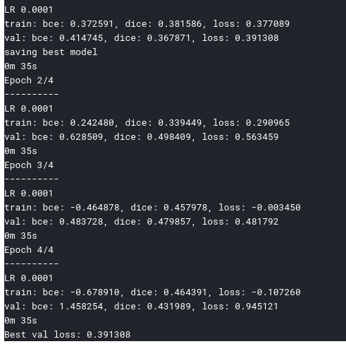

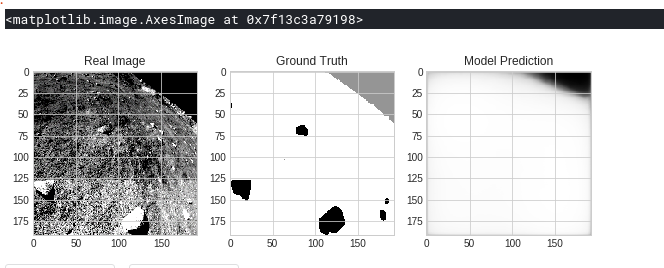

D18:
----------

Milestone: 
1. Continued on implementing image segmentation model from day 14. I got the trainloader and model working and I got a loss of 0.40 using 10% of the data for training. Generated masks are somehow incomplete. But it is something. Will implement other PyTorch solutions and increase the data size.
2. This is a late post but I joined in to the second meeting of #sg_spaic.

https://github.com/anvillasoto/30-days-of-udacity#D18

&#35;30DaysofUdacity

D17:
----------

Milestone:
1. Reviewed Lessons 1 and 2 from Intro to Computer Vision course. 
2. Continued on implementing image segmentation model from day 14. Data loaders for original images and their masks is a tough one to crack. But I got the PyTorch UNET simulation working with images resized to 190 x 190 (per the repos recommendation).

https://github.com/anvillasoto/30-days-of-udacity#D17

&#35;30DaysofUdacity

D16:
----------

Milestone:
1. Finished Lesson 2: Images as Functions of Introduction to Computer Vision course. 
2. Continued on implementing image segmentation model from day 14. I rested for one day that is why the implementation has been halted. Will continue this tomorrow. 

https://github.com/anvillasoto/30-days-of-udacity#D16

&#35;30DaysofUdacity

D15:
----------

Milestone:
1. Finished Lesson 1: 1A-L1 Introduction of Introduction to Computer Vision course. 
2. Continued on implementing image segmentation model from day 14. Now using a portion of real dataset. Screenshots will come soon. I am not proud of my progress just yet. :D

https://github.com/anvillasoto/30-days-of-udacity#D15

&#35;30DaysofUdacity

D14:
----------

Milestone:
1. Explored the pytorch-unet implementation from https://github.com/usuyama/pytorch-unet to be used in Image Segmentation model that I am exploring. Yesterday was a flop so I hope this could be a good one.

https://github.com/anvillasoto/30-days-of-udacity#D14

&#35;30DaysofUdacity

D13:
----------

Milestone:
1. Hurrah, after two days of tweaking, I got the PyTorch UNET working as well as a vgg16 model with almost laughable accuracy. Will tweak this on later days. 
2. Started Introduction to Computer Vision course from Udacity.

https://github.com/anvillasoto/30-days-of-udacity#D13

&#35;30DaysofUdacity

D12:
----------

Milestones:
1. Set up environment for PyTorch UNET model for the segmentation model we are exploring. Tried to run it with no luck. Will try again tomorrow.
2. Read paho-mqtt for working with real-time communication. I explored this using node-red before. It is nice to have a Python alternative.

https://github.com/anvillasoto/30-days-of-udacity#D12

&#35;30DaysofUdacity

D11:
----------

Milestones:

1. This marks the 11th day. I officially finished the course. Will focus on projects now.

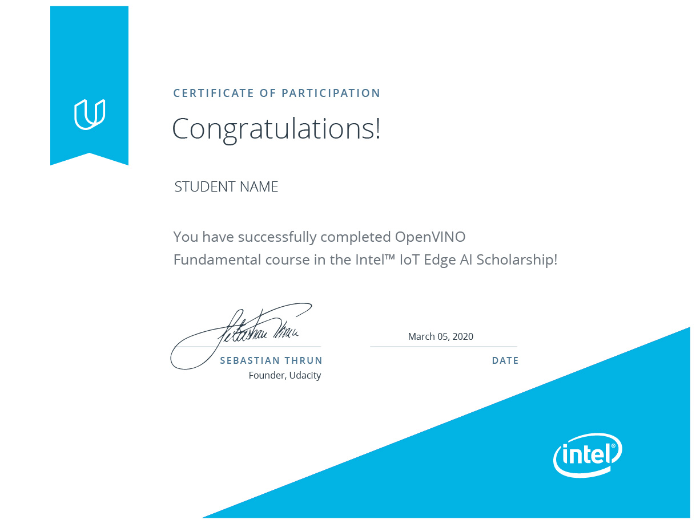

2. Participated in the weekly meeting initiative of #sg_spaic.

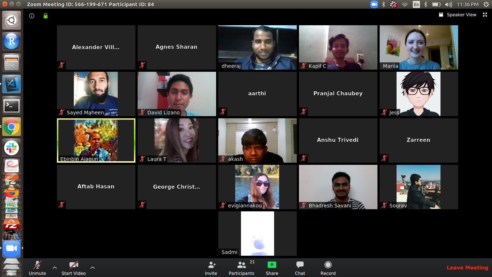

https://github.com/anvillasoto/30-days-of-udacity#D11

&#35;30DaysofUdacity

D10:
----------

This marks the 10th day of the challenge. Watched videos from lesson 5: Deploying an Edge App. Project is challenging so I probably need to explore it on another day. 

https://github.com/anvillasoto/30-days-of-udacity#D10

&#35;30DaysofUdacity

D09:
----------

Run through lesson 4: The Inference again tor reinforce the knowledge. But I did not quite get the inference project. Hope I could get it done tomorrow.

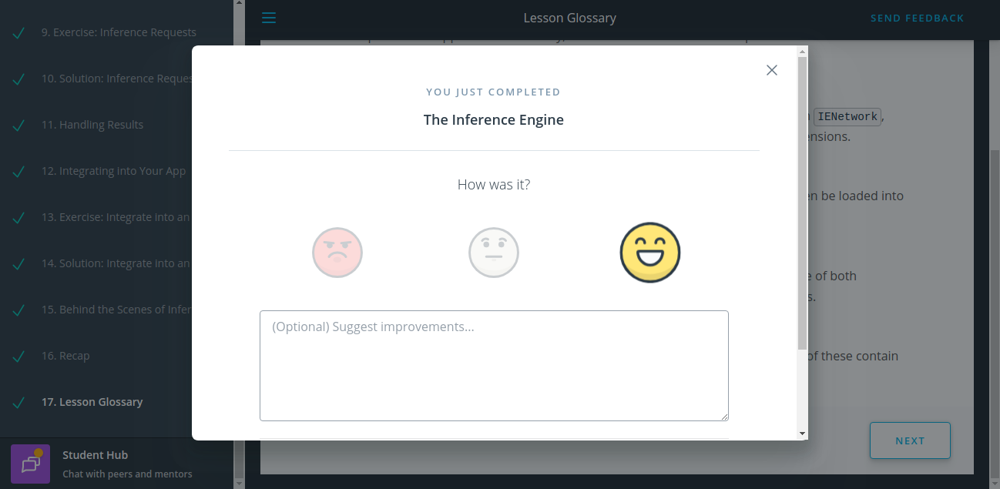

https://github.com/anvillasoto/30-days-of-udacity#D09

&#35;30DaysofUdacity

D08:
----------

Finished the second half of lesson 4: The Inference Engine. Will need another pass for this lesson before proceeding to lesson 5.

Here comes another good news. Yesterday, I participated in motivational stories initiative posted on the motivations channel. I was actually tagged by one of my active fellow scholar in her really amazing motivational story that I compelled to share mine. It is later today that I realized that something weird happened due to numerous mentions and direct messages I received. I realized that my story, of all equally motivating ones was featured in the announcements channel. 

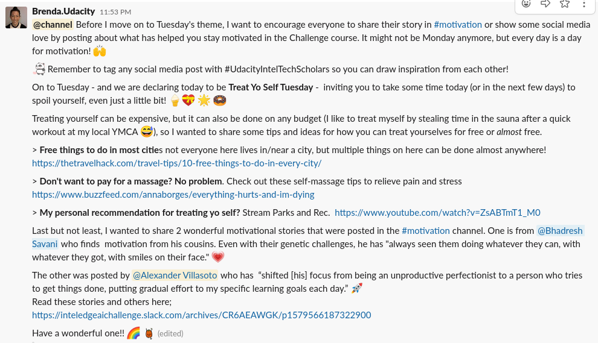

This is totally unexpected. To the people who appreciated my story, thank you.

https://github.com/anvillasoto/30-days-of-udacity#D08

&#35;30DaysofUdacity

D07:
----------

Finished the first half of Lesson 4: The Inference Engine. Topics that I came across with include the Inference Engine overview, supported devices (luckily all Intel hardware), Connecting Inference Engine with Intermediate Representation and Sending inference requests synchronously and asynchronously. 

I am mostly excited with these topics because this is where we start seeing how the model spits out predictions. I am really looking forward to the rest of the chapter videos and exercises.

https://github.com/anvillasoto/30-days-of-udacity#D07

&#35;30DaysofUdacity

D06:
----------

Milestones:
1. Rewatched the videos from Lesson 3: The Model Optimizer and implemented again the exercises from it. 
2. Read the article from Towards Data Science Medium post entitled [What is the Best Programming Language for Machine Learning?](https://towardsdatascience.com/what-is-the-best-programming-language-for-machine-learning-a745c156d6b7). As a JavaScript developer by profession, I am surprised that a significant amount of professionals use JS to their daily ML tasks. Although most of my trainings for AI and ML are in Python, I am really excited to be in a programming language-agnostic world since as the article would say, there is no best programming language for AI. That, like any other CS problems to solve, depends on the use case.

https://github.com/anvillasoto/30-days-of-udacity#D06

&#35;30DaysofUdacity

D05:
----------

Milestones:
1. Finished the second half of lesson 3: The Model Optimizer. This is a lot for me to take in so I probably need to review this lesson once more before going to lesson 4.
2. Attended my first meeting for this challenge with my fellow #sg_spaic classmates. We talked about several project ideas as well as community initiatives.

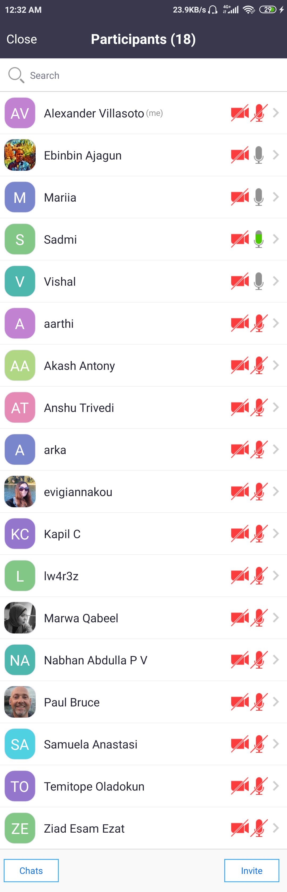

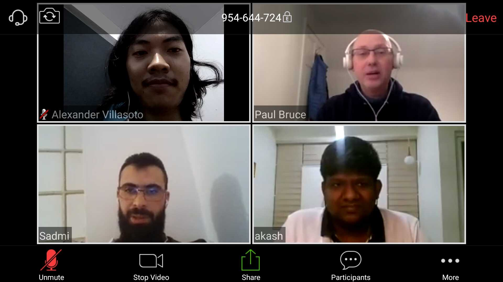

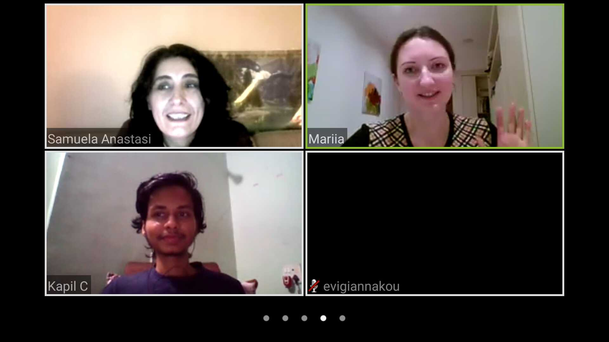

https://github.com/anvillasoto/30-days-of-udacity#D05

&#35;30DaysofUdacity

D04:
----------
Finished half of lesson 3: The Model Optimizer. This is getting really technical. I hope I can finish the whole module tomorrow. 

Another good news for me. I received my Acclaim Badge for Advanced Data Science Specialist that I acquired from finishing all the four courses in the Advanced Data Science with IBM Specialization on Coursera.

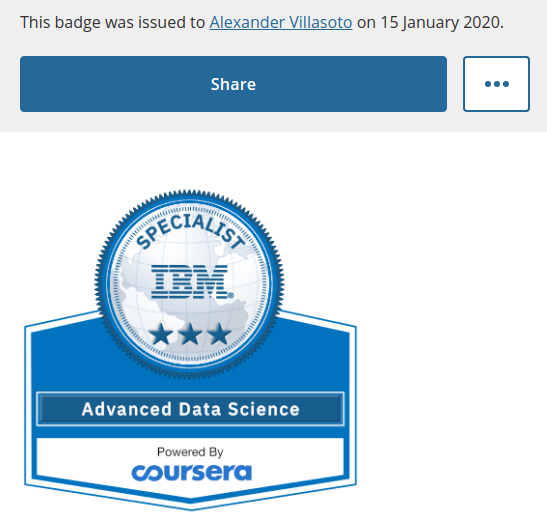

https://github.com/anvillasoto/30-days-of-udacity#D04

&#35;30DaysofUdacity

D03:
----------
Finished Lesson 2: Leveraging Pre-Trained Models

Here comes another good news. I applied last year to Bertelsmann Tech Scholarship Cloud Track. I got a rejection letter. But a month later, I got a confirmation that they opened slots for additional students and I got in. There are so many things to learn in a couple of opportunities that opened for me from Intel, Facebook and Bertelsmann. This year started with lots of surprises. I am willing to take the challenge. 

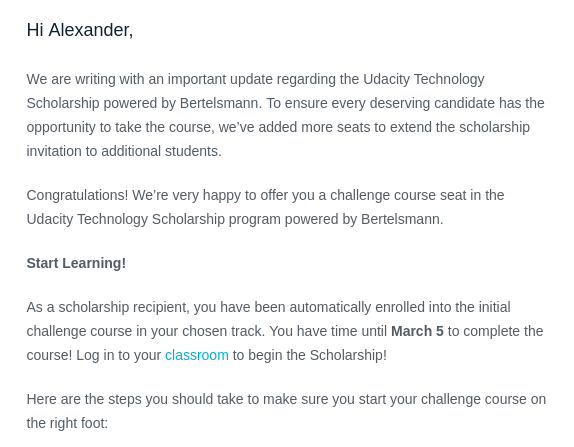

https://github.com/anvillasoto/30-days-of-udacity#D03

&#35;30DaysofUdacity

D02:
----------
Finished Lesson 1: Introduction to AI at the Edge

Another good news from Facebook. Last year, I applied for the Developer Circle Training Courses for the Quarter 1 of 2020. I chose the web development track since that is my current role and I want to further my skills in front-end development since that is the area that I think I am lacking as a full-stack developer. Two days ago, I got an e-mail sending me an invite to OpenClassrooms to learn ReactJS. This will take a significant amount of my time that are ought to be for this course but I am up for the challenge and I am really excited.

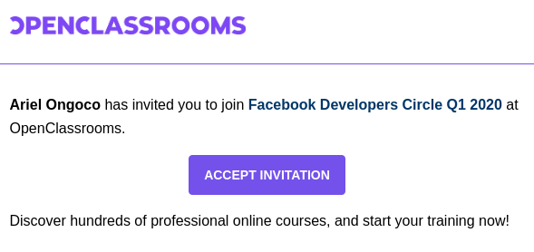

https://github.com/anvillasoto/30-days-of-udacity#D02

&#35;30DaysofUdacity

D01:
----------
I am really glad to say that on this day, I received my specialization certificate for the Advanced Data Science with IBM through Coursera. I polished my Architectural Decisions Document for the project that I did entitled ECG Heartbeat Categorization Prediction Project as well as uploaded my presentation video. All of which are part of the Advanced Data Science Capstone before receiving the specialization certificate.

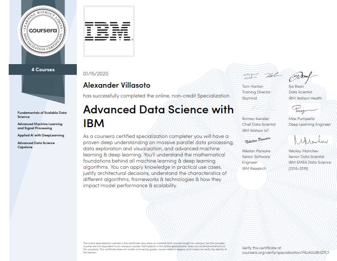

This is my first day actually working on the challenge due to Christmas break. Now I am ready to participate. I hope it is not too late.

https://github.com/anvillasoto/30-days-of-udacity#D01

&#35;30DaysofUdacity